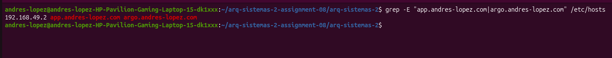
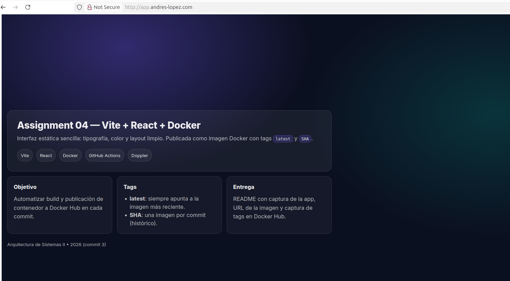
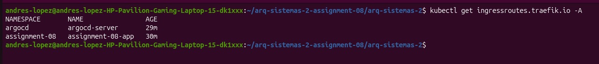
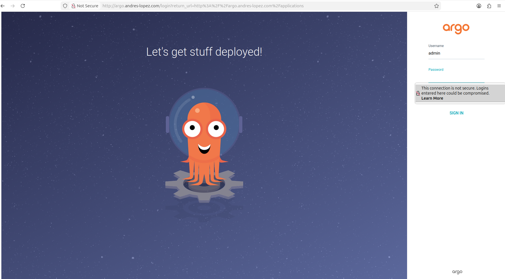
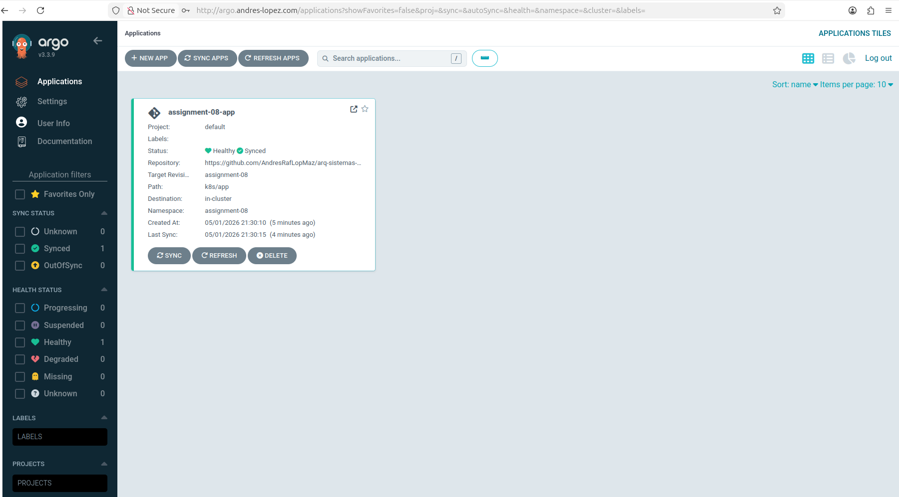
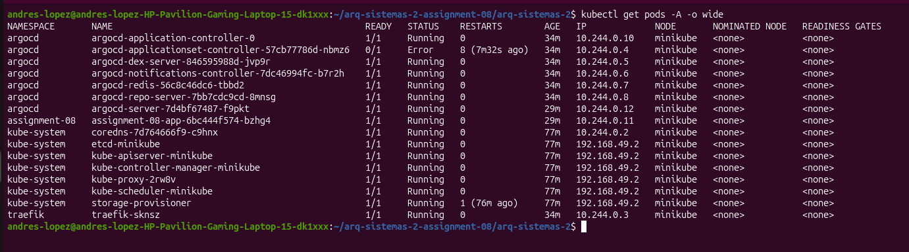

# Assignment 08 - Kubernetes con Minikube, Traefik y ArgoCD

## Descripción

Esta práctica consiste en crear un clúster local de Kubernetes usando Minikube, instalar Traefik como controlador de rutas, instalar ArgoCD como herramienta GitOps y desplegar una aplicación dockerizada reutilizando la aplicación de la semana 4.

El objetivo principal es que toda la configuración pueda ejecutarse mediante archivos YAML y scripts, aplicando el enfoque de Infraestructura como Código.

---

## Tecnologías utilizadas

| Tecnología | Función dentro del proyecto |
|---|---|
| Ubuntu 25.10 | Sistema operativo base |
| Docker | Construcción de la imagen de la aplicación |
| Minikube | Clúster local de Kubernetes |
| kubectl | Administración del clúster |
| Helm | Renderizado de manifiestos de Traefik |
| Traefik | Enrutamiento HTTP mediante IngressRoute |
| ArgoCD | Gestión GitOps de la aplicación |
| React + Vite | Aplicación web reutilizada de la semana 4 |
| Nginx | Servidor web dentro del contenedor |

---

## Dominios configurados

Para simular un entorno más realista se configuró DNS local mediante el archivo `/etc/hosts`.

| Servicio | Dominio local |
|---|---|
| Aplicación web | `http://app.andres-lopez.com` |
| ArgoCD | `http://argo.andres-lopez.com` |

Entrada usada en `/etc/hosts`:

```txt
192.168.49.2 app.andres-lopez.com argo.andres-lopez.com
```

La IP puede cambiar dependiendo de la IP asignada por Minikube.

Evidencia:


---

## Estructura del repositorio

```txt
.
├── assignment-04-app/
│   ├── Dockerfile
│   ├── package.json
│   ├── src/
│   └── public/
├── docs/
│   └── images/
│       ├── app-dns.png
│       ├── argocd-dashboard.png
│       ├── argocd-login.png
│       ├── hosts.png
│       ├── ingressroutes.png
│       └── pods.png
├── k8s/
│   ├── namespaces.yaml
│   ├── app/
│   │   ├── deployment.yaml
│   │   ├── service.yaml
│   │   └── ingressroute.yaml
│   ├── argocd/
│   │   ├── install.yaml
│   │   ├── argocd-cmd-params-cm.yaml
│   │   ├── ingressroute.yaml
│   │   └── application-app.yaml
│   └── traefik/
│       ├── values.yaml
│       ├── traefik-crds.yaml
│       └── traefik-rendered.yaml
├── scripts/
│   ├── 00-build-image.sh
│   ├── 01-install-all.sh
│   └── 02-configure-dns.sh
└── README.md
```

---

## Manifiestos de Kubernetes

### Namespaces

Archivo:

```txt
k8s/namespaces.yaml
```

Este manifiesto crea los namespaces principales:

- `traefik`
- `argocd`
- `assignment-08`

---

### Aplicación web

Archivos:

```txt
k8s/app/deployment.yaml
k8s/app/service.yaml
k8s/app/ingressroute.yaml
```

La aplicación se despliega mediante un `Deployment`, se expone dentro del clúster mediante un `Service` tipo `ClusterIP` y se publica por medio de un `IngressRoute` de Traefik.

Dominio usado:

```txt
app.andres-lopez.com
```

Evidencia:


---

### Traefik

Archivos:

```txt
k8s/traefik/values.yaml
k8s/traefik/traefik-crds.yaml
k8s/traefik/traefik-rendered.yaml
```

Traefik se instaló como controlador de rutas dentro del clúster. Se utilizó el recurso `IngressRoute` para manejar las rutas HTTP de la aplicación y de ArgoCD.

Evidencia:


---

### ArgoCD

Archivos:

```txt
k8s/argocd/install.yaml
k8s/argocd/argocd-cmd-params-cm.yaml
k8s/argocd/ingressroute.yaml
k8s/argocd/application-app.yaml
```

ArgoCD se instaló en el namespace `argocd` y se expuso mediante Traefik con el dominio:

```txt
argo.andres-lopez.com
```

La aplicación registrada en ArgoCD se llama:

```txt
assignment-08-app
```

Configuración GitOps usada:

| Campo | Valor |
|---|---|
| Repositorio | `https://github.com/AndresRafLopMaz/arq-sistemas-2` |
| Rama | `assignment-08` |
| Ruta | `k8s/app` |
| Namespace destino | `assignment-08` |

Evidencias:




---

## Comandos ejecutados

### 1. Crear rama de trabajo

```bash
git checkout main
git pull origin main
git checkout -b assignment-08
```

---

### 2. Iniciar Minikube

```bash
minikube config set driver docker
minikube start --driver=docker --cpus=4 --memory=3072 --disk-size=12g
```

---

### 3. Validar estado del clúster

```bash
minikube status
kubectl get nodes -o wide
kubectl get pods -A
```

---

### 4. Construir imagen local de la aplicación

```bash
./scripts/00-build-image.sh
```

Comando principal ejecutado por el script:

```bash
minikube image build -t assignment-08-app:1.0.0 ./assignment-04-app
```

---

### 5. Instalar Traefik, ArgoCD y la aplicación

```bash
./scripts/01-install-all.sh
```

Este script aplica los manifiestos YAML de:

- Namespaces
- CRDs de Traefik
- Traefik
- ArgoCD
- Configuración HTTP de ArgoCD
- IngressRoute de ArgoCD
- Aplicación web
- IngressRoute de la aplicación
- Aplicación GitOps de ArgoCD

---

### 6. Configurar DNS local

```bash
./scripts/02-configure-dns.sh
```

Este script obtiene la IP de Minikube y agrega los dominios locales en `/etc/hosts`.

---

### 7. Validar rutas HTTP

```bash
curl -I --noproxy "*" http://app.andres-lopez.com
curl -I --noproxy "*" http://argo.andres-lopez.com
```

Resultado esperado:

```txt
HTTP/1.1 200 OK
```

---

## Evidencias de ejecución

### Pods del clúster

Comando utilizado:

```bash
kubectl get pods -A -o wide
```


---

### IngressRoutes configurados

Comando utilizado:

```bash
kubectl get ingressroutes.traefik.io -A
```


---

### DNS local configurado

Comando utilizado:

```bash
grep -E "app.andres-lopez.com|argo.andres-lopez.com" /etc/hosts
```


---

### Aplicación funcionando

URL usada:

```txt
http://app.andres-lopez.com
```


---

### ArgoCD funcionando

URL usada:

```txt
http://argo.andres-lopez.com
```


---

### Aplicación sincronizada en ArgoCD

Estado observado:

```txt
Healthy
Synced
```


---

## Validación final

Se comprobó que:

- Minikube está en estado `Running`.
- El nodo del clúster está en estado `Ready`.
- Traefik está desplegado y funcionando.
- ArgoCD está desplegado y accesible mediante DNS local.
- La aplicación web está desplegada y accesible mediante DNS local.
- Los recursos `IngressRoute` están creados correctamente.
- La aplicación aparece en ArgoCD con estado `Healthy` y `Synced`.

---

## Seguridad

La contraseña inicial de ArgoCD se obtiene desde un secreto de Kubernetes.

Comando usado localmente para obtenerla:

```bash
kubectl -n argocd get secret argocd-initial-admin-secret \
  -o jsonpath="{.data.password}" | base64 -d
echo ""
```

---

## Enlace de entrega

Rama utilizada:

```txt
assignment-08
```

Repositorio:

```txt
https://github.com/AndresRafLopMaz/arq-sistemas-2/tree/assignment-08
```
