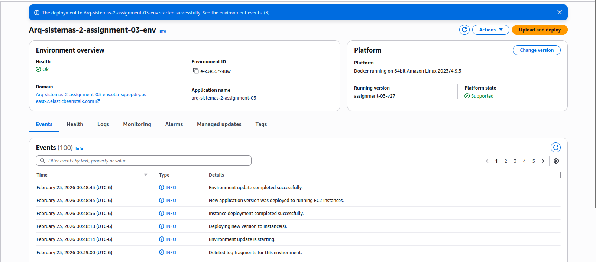
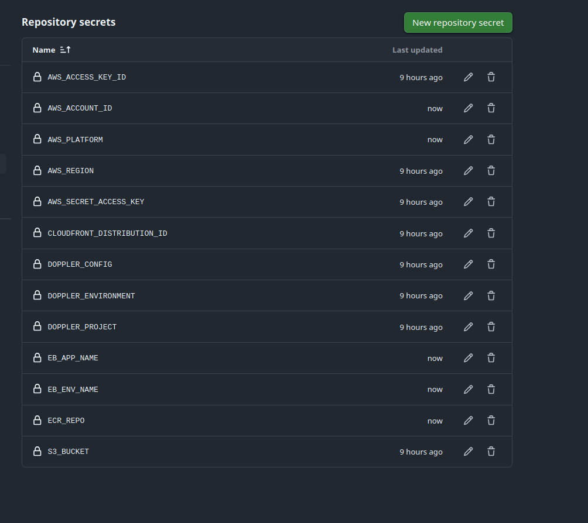
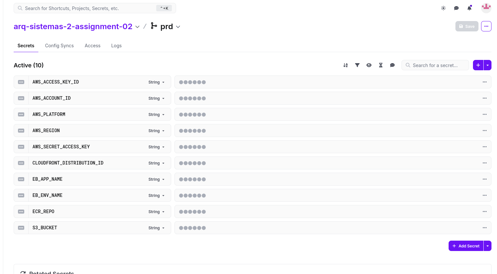
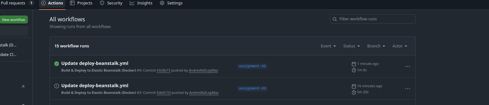
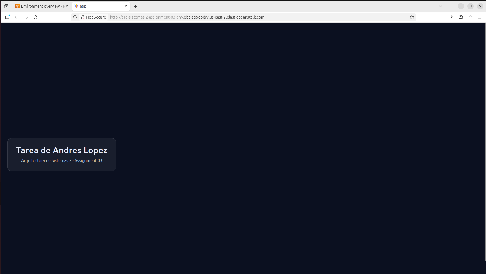

# Assignment 03 — Docker + AWS Elastic Beanstalk + GitHub Actions

Aplicación desplegada en AWS Elastic Beanstalk:

- URL: http://arq-sistemas-2-assignment-03-env.eba-sqpepdry.us-east-2.elasticbeanstalk.com/

## Captura de la aplicación

# Assignment 03 — Docker + AWS Elastic Beanstalk + GitHub Actions

Aplicación desplegada en AWS Elastic Beanstalk:

- URL: http://arq-sistemas-2-assignment-03-env.eba-sqpepdry.us-east-2.elasticbeanstalk.com/

## Captura de la aplicación

## Secretos con Doppler

Se utilizó **Doppler** para gestionar credenciales/variables necesarias para el despliegue (AWS/ECR/Beanstalk).  
Doppler está sincronizado con GitHub Actions para que los secrets se mantengan actualizados en el repositorio sin exponerlos en el código.

### Evidencia (capturas)

- Integración Doppler ↔ GitHub Actions  
  

- Secretos configurados para la entrega  
  

- Configuración/alta de secrets relacionados al despliegue  
  

  ## Dockerización

La aplicación fue dockerizada para ejecutarse como contenedor.  
Se construye una imagen Docker y se publica en Amazon ECR, y desde ahí se despliega a Elastic Beanstalk (plataforma Docker).

## Pipeline de GitHub Actions

Dentro de `.github/workflows/` se configuró un workflow que realiza:

1. Checkout del repositorio
2. Configuración de credenciales AWS (por secrets)
3. Login a Amazon ECR
4. Build & push de la imagen Docker a ECR
5. Despliegue a AWS Elastic Beanstalk

### Evidencia (captura de workflow)

## Capturas de configuración de AWS Elastic Beanstalk

