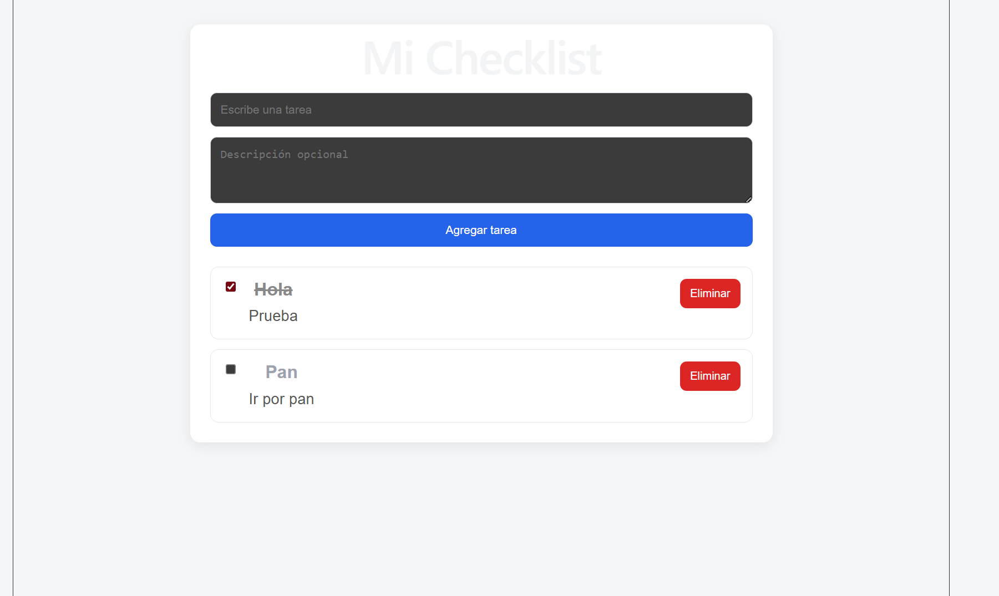
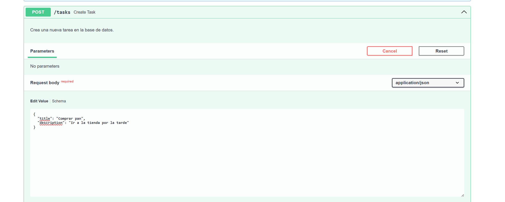
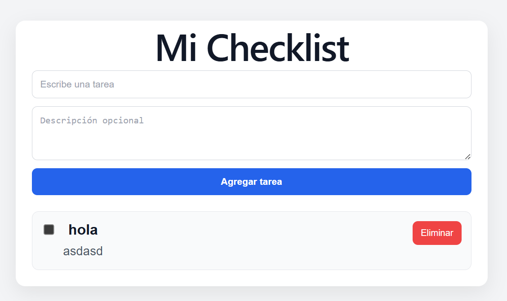
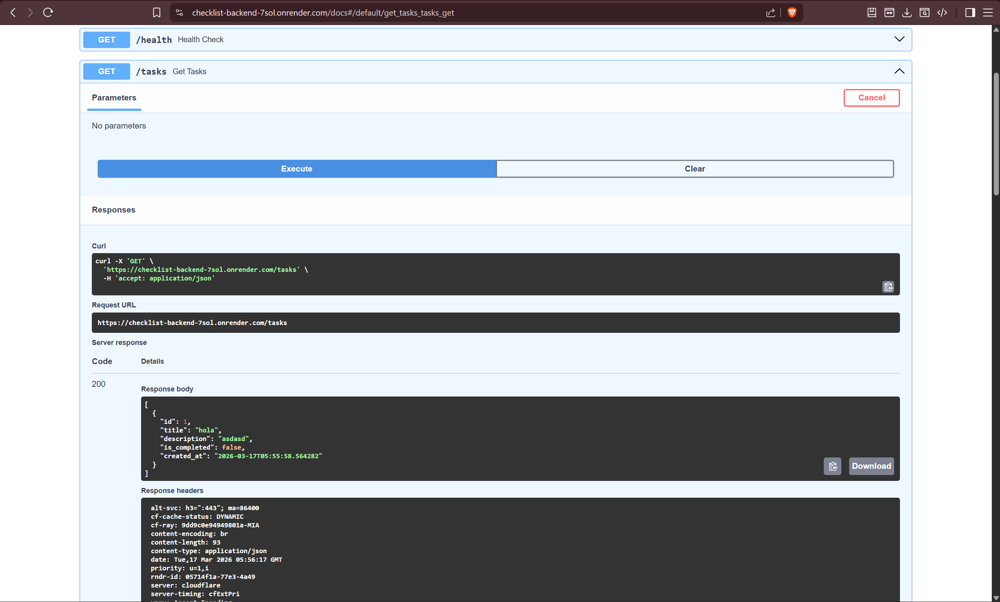
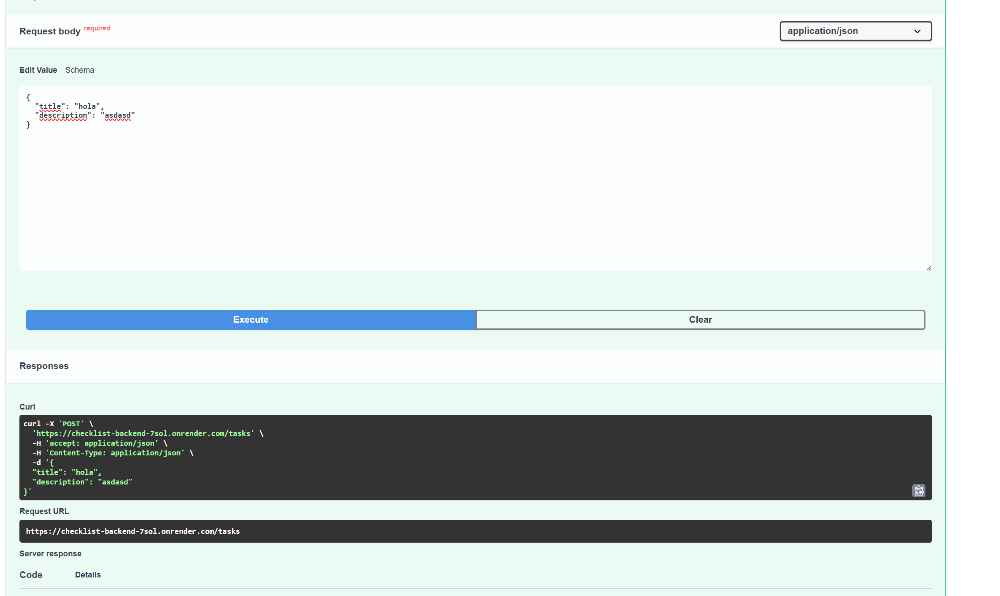
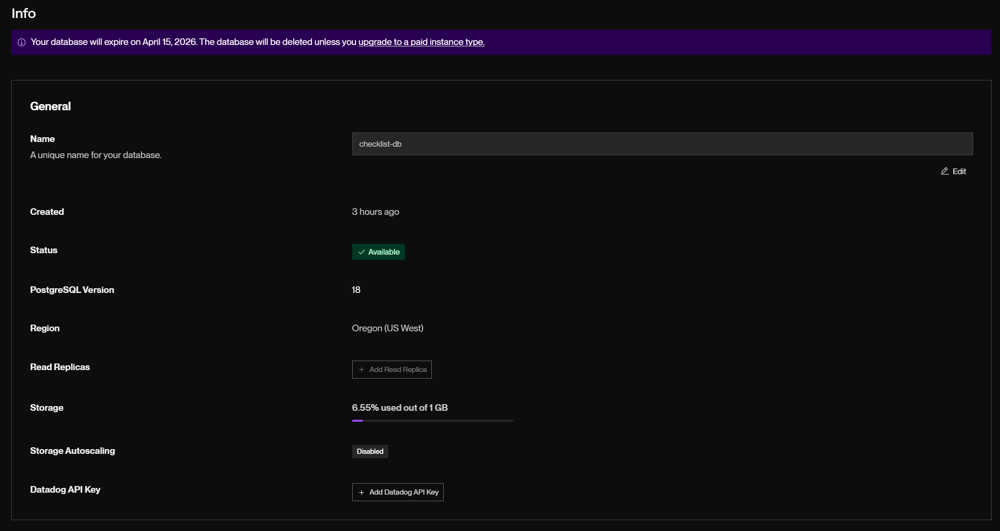
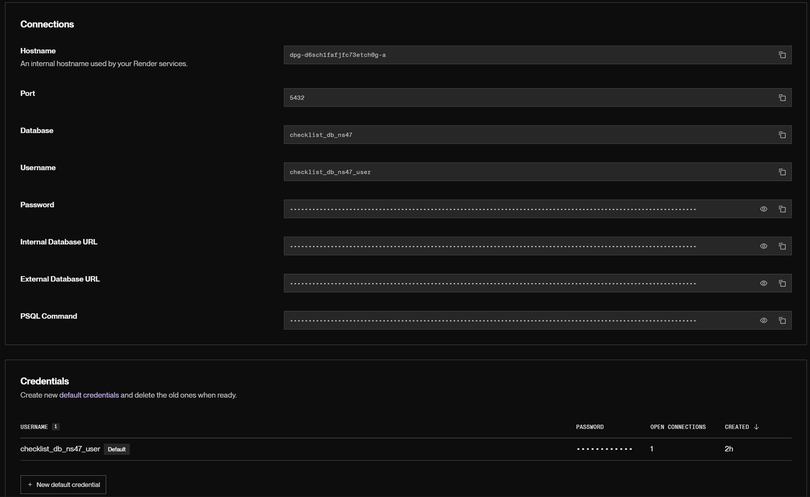

# Assignment 05 - Aplicación web en monorepo

## Descripción
Este proyecto es una aplicación web de checklist desarrollada en estructura monorepo.  
Incluye frontend, backend y base de datos en la nube.

## Rama de trabajo
- `assignment-05`

## Enlaces de despliegue
- Frontend: https://checklist-frontend-64wy.onrender.com
- Backend: https://checklist-backend-7sol.onrender.com
- Documentación API: https://checklist-backend-7sol.onrender.com/docs

## Tecnologías usadas
- Frontend: React + Vite
- Backend: FastAPI
- Base de datos: PostgreSQL en Render
- ORM: SQLAlchemy
- Migraciones: Alembic

## Estructura del proyecto
```text
arq-sistemas-2/
├── frontend/
├── backend/
├── docs/
│   └── images/
└── README.md
```

## Funcionalidades
- Crear tareas
- Listar tareas
- Modificar tareas
- Eliminar tareas

## Evidencias

Registro en frontend local



Registro en backend local



Reflejo en frontend web



Registro en backend web



Modificación en backend web



Creación de base de datos



Configuración de base de datos

