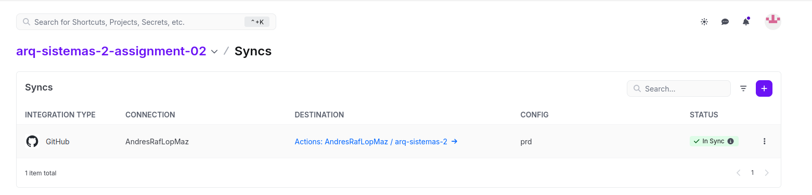
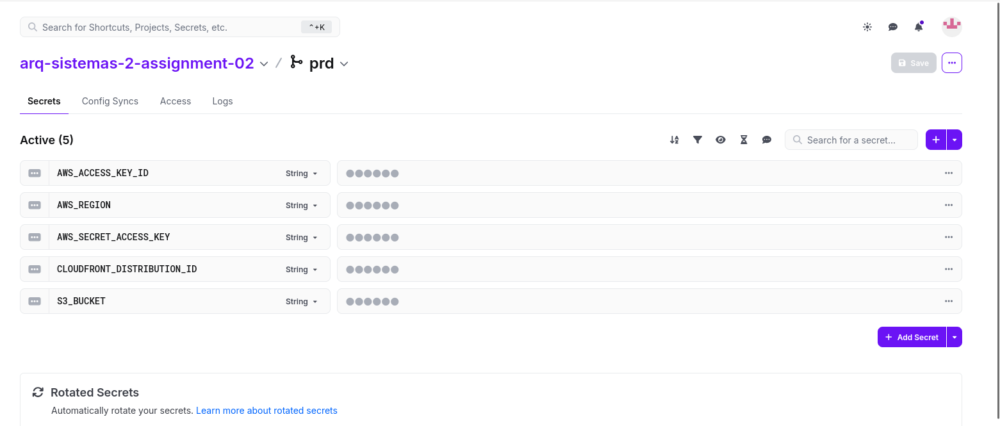
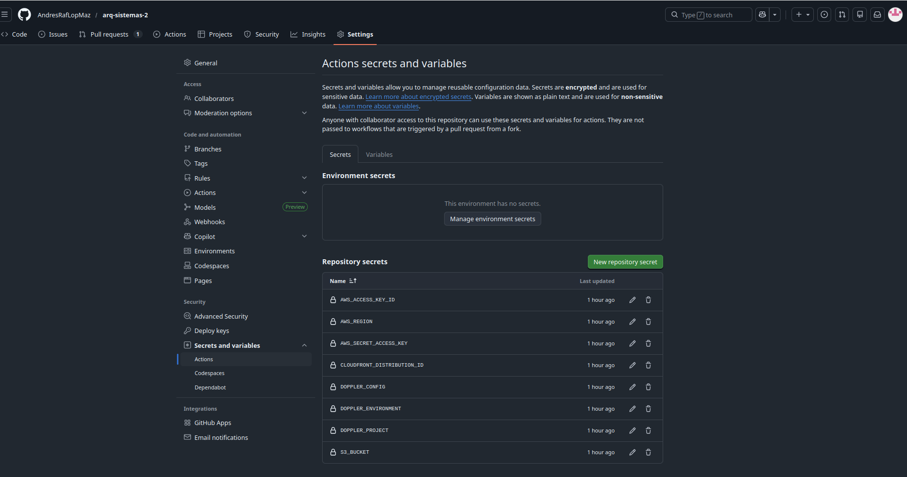
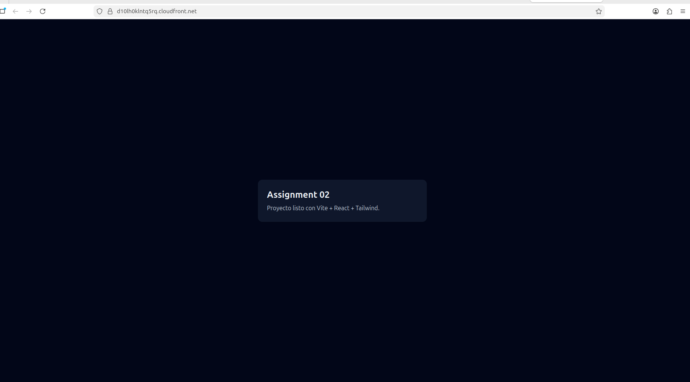

# Assignment 02 — Vite + React + Tailwind en CDN (AWS S3 + CloudFront)

Aplicación web estática creada con **Vite + React + TypeScript + Tailwind** y publicada en un **CDN de AWS (S3 + CloudFront)**.  
Despliegue automático con **GitHub Actions**: build → upload a S3 → invalidate CloudFront.

---

## URL pública (CDN)
- CloudFront: https://d10lh0klntq5rq.cloudfront.net/

---

## Tecnologías
- Vite + React + TypeScript
- TailwindCSS
- AWS S3
- AWS CloudFront
- Doppler
- GitHub Actions

---

## Build local
```bash
npm install
npm run build

```


---

## Segmento 2/3 — Doppler + GitHub Secrets (con capturas)


## Doppler

### Config Syncs (Doppler ↔ GitHub)



### Variables / Secrets en Doppler (valores ocultos)



Secrets usados en Doppler:
- AWS_ACCESS_KEY_ID
- AWS_SECRET_ACCESS_KEY
- AWS_REGION
- S3_BUCKET
- CLOUDFRONT_DISTRIBUTION_ID

---

## GitHub Secrets




## GitHub Actions Pipeline

Workflow:
- `.github/workflows/deploy-cdn.yml`

Acciones del pipeline:
1. **Build**: `npm ci` y `npm run build`
2. **Upload**: sube el contenido de `dist/` al **root** del bucket S3
3. **Invalidate**: invalida CloudFront (`/*`)

---

## Evidencia de la aplicación




---

## Entregables
- Repositorio: https://github.com/AndresRafLopMaz/arq-sistemas-2
- Rama: `assignment-02`
- URL pública (CDN): https://d10lh0klntq5rq.cloudfront.net/


