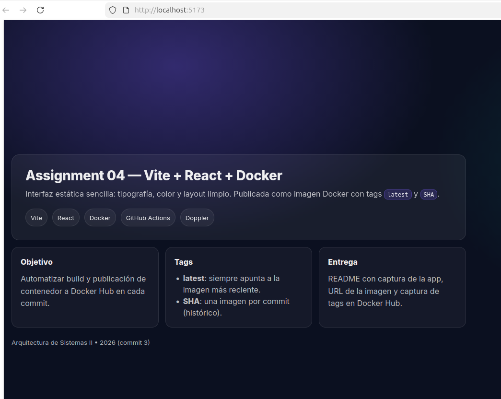
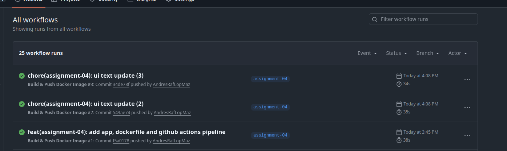
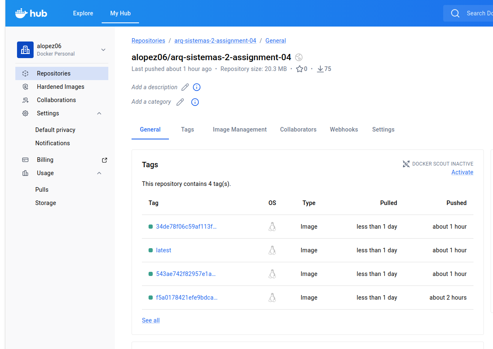

# Assignment 04 — Vite + React + Docker + Doppler + GitHub Actions

Repositorio (rama de entrega): `assignment-04`

## Captura de la aplicación (Vite)

## Captura de la aplicación (Docker)

## Docker Hub
**Imagen (latest):** `docker.io/alopez06/arq-sistemas-2-assignment-04:latest`

**Repositorio en Docker Hub:** https://hub.docker.com/r/alopez06/arq-sistemas-2-assignment-04

## GitHub Actions (pipeline)

## Evidencia de tags (latest + SHA por commit)

